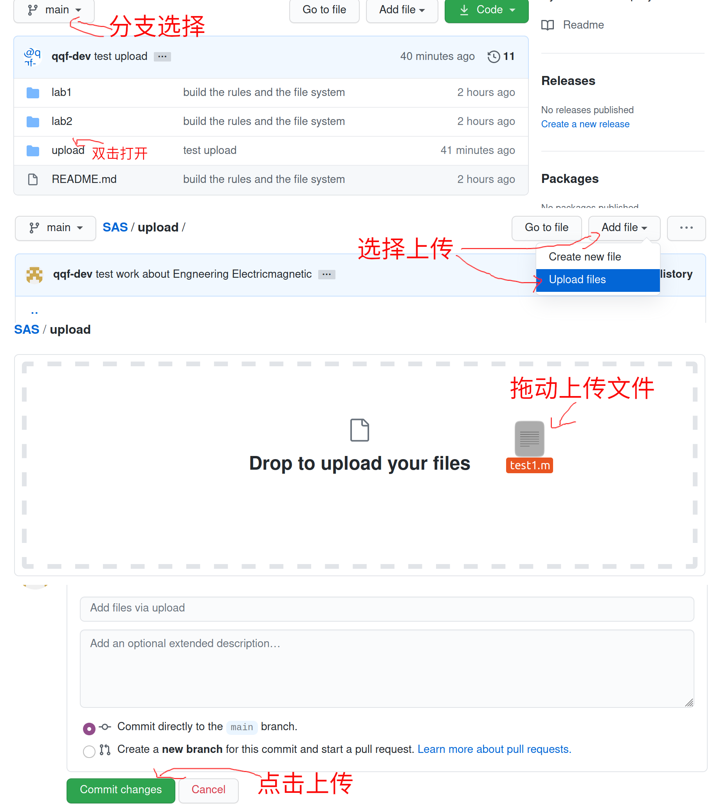

# SAS

This git project is about the work on Signal and System lab and project, bulided by qqf-dev.

This work is based on **MATLAB**.

The **master** branch is for qqf-dev write only.

这个git项目是关于信号与系统课程的实验和合作工程的共同开发, 由qqf-dev建立。

这个项目基于**MATLAB**实现。

**master**分支仅限qqf-dev修改。

### Structure

---

The file system is follow these rules:

* Each lab or project has a corresponding file folder like **"lab\*"** or **"project\*"**.
* Each folder has a folder **doc**, there will are the lab ppt and other related documents.
* Each folder has the script of **MATLAB** (file .m), **"ex"** is for exercise on lab, **"work"** is for the assignment of each lab, **part** is for the work of each project.
* After the file name of **MATLAB** script, the structure **"-\*"** is for the editor, such as "-q" is for the file which is "qqf-dev" edited.
* In the project folder, it should only one script file for one work, so under code, different work name follow **"work\*"**.
* In the project folder, **"code"** folder is for **MATLAB** code, **"figure"** folder is for pitures, **"pre"** folder is for the presentation
* In the **main** branch, there is a folder named **"upload"** for partner to upload file, It doesn't have to follow the file system rules.
* In **"upload"** folder, file with editor name will be appreciated.
* "qqf-dev" will edit code in **"upload"** to follow the rules.

文件系统遵循以下规则：

* 每个lab课或project有对应的文件夹如 **"lab\*"** 或是 **"project\*"**.
* 每个文件夹有 **doc**文件夹用来储存课堂ppt和相关资料.
* 每个文件夹下都有**MATLAB**脚本（.m文件），**"ex"** 是课堂练习，**"work"** 是作业相关，**"part"** 是project相关。
* 在每个**MATLAB**脚本名字的后面会有如 **"-\*"** 的结构用来表示作者。像是 "-q" 就是指 "qqf-dev" 所编辑的.
* 在project文件夹里，应该只有一个版本的脚本代码，遵循 **"work\*"** 这样的规则。
* 在project文件夹里，**"code"** 用来存 **MATLAB** 代码, **"figure"** 用来存图片, **"pre"** 用来存报告
* 在**main**分支里的 **"upload"** 文件夹是用来收集组员上传的文件，其中的文件不需要遵守文件系统规则
* **"upload"** 文件夹里的文件最好附上姓名
* "qqf-dev" 会将 **"upload"** 里的文件重命名并使其遵守文件系统规则

### RULES

---

> ###### The rules is for the partner using github to share code. If you don't familar to use github, just push the file into the upload file in the "upload" in the "main" branch.

> ###### 以下规则是为了规范组员分享代码在github上。如果你不熟悉或是不想那么麻烦，就只用拖动文件到"main"分支下的"upload"文件夹即可

If any partner want to use github to join this work, please follow these rules:

* You can create any branch in this work, but please do not delete oe edit other's work branch.
* You can push your code or merge your branch into the **"main"** branch, but pleaso follow the rule of file system.
* Everything you push into the github is public in the invited group. If you have anything unable to share, please keep it on your own computer.
* Even there are other code for lab assignment or else, please finish your work by yourself.

如果任意成员想通过github完成工作，请遵循以下规则：

* 可以创建任意分支，但请不要删除或更改他人的分支。
* 可以任意上传或合并分支到 **"main"** 分支中。
* 任何你上传的代码或文件在组内是共享的。如果有任何不想分享的文件，请勿上传。
* 即使其他人完成作业并分享代码到github上，也请独立完成作业。
